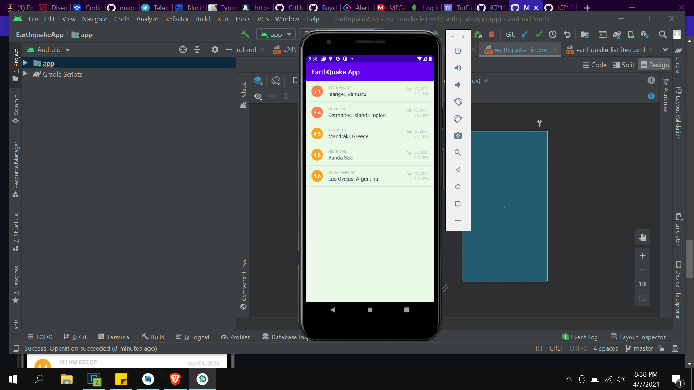
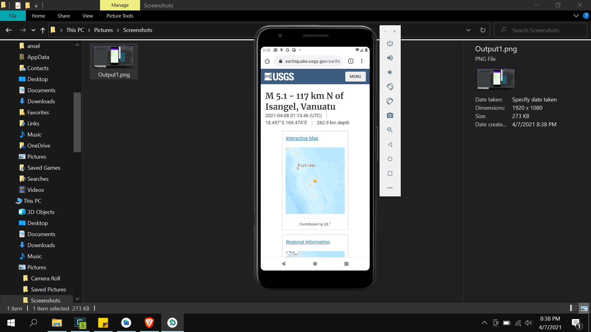

# ICP 10

This ICP is about learning how to use api in mobile application. For this we have used usgs api. ** https://earthquake.usgs.gov/fdsnws/event/1/ **

The task of this ICP is to display list of eathquake information. When user clicks on the any item of the displayed list he should be redirected to webpage giving more details about it.

# OUTPUTS

1. Initial Screen when app is loaded which displays the list of eathquakes

   

2. When user clicks on a link he will be transfered to the webpage displaying all the information about that particular data
   .
   
