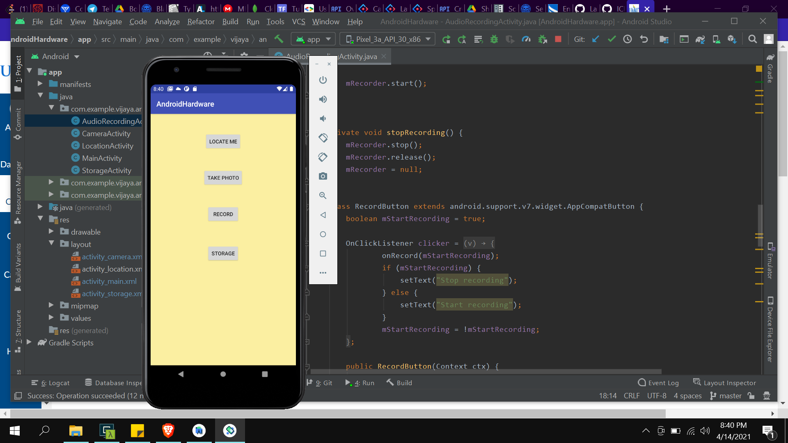
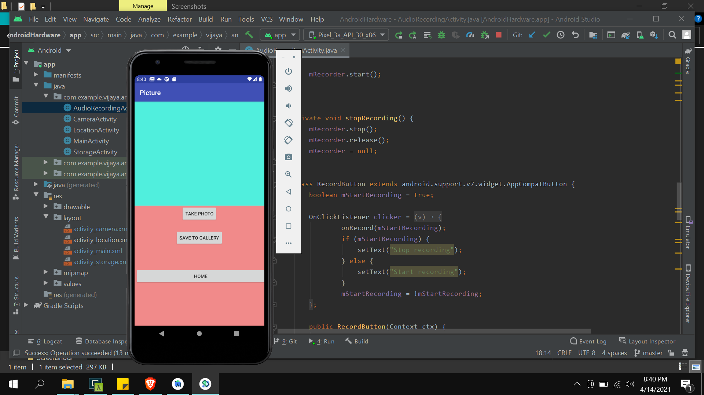
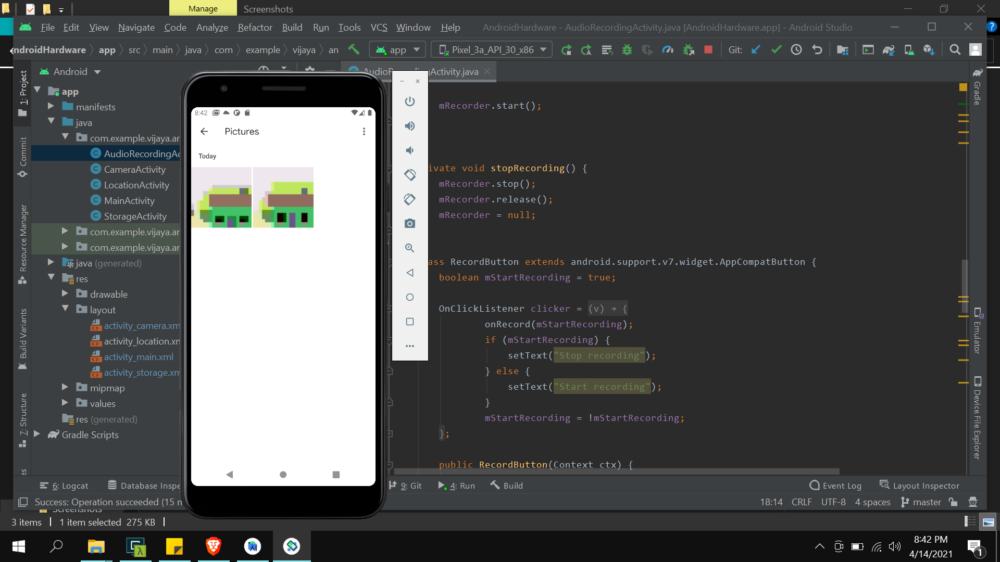
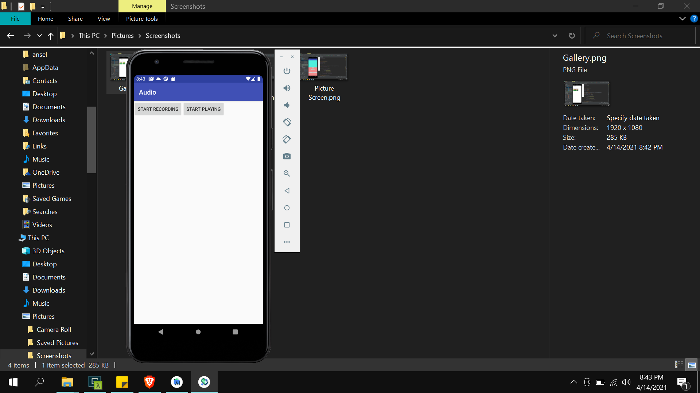
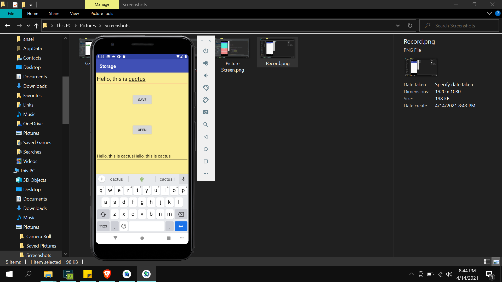

# This is the Readme file for my ICP11 work

In which in this icp i've learned how to use the different android system components like camera, location.

Our task is to use location and display our location and use camera and take a picture and display. Also use microphone and record an audio. And finally use the storage to store and retrive the data that we commited.

# OUTPUTS

Initial screen when application is loaded.

Picture Screen

Gallery containing images taken using camera

Record Screen

Storage Screen

Location Screen

