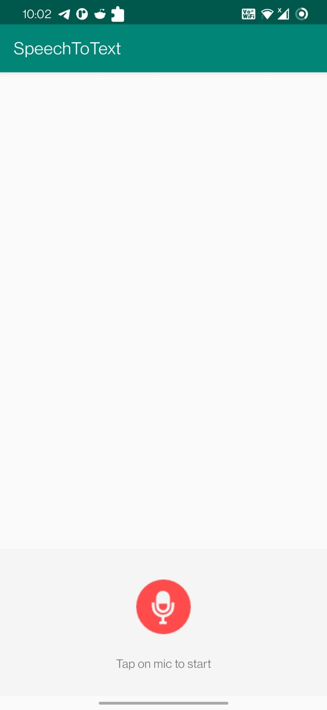
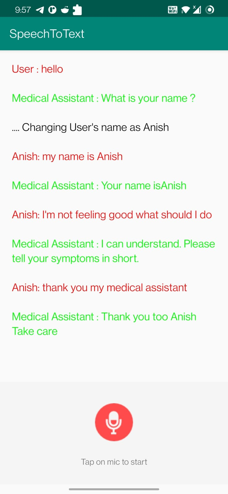

# This is the readme for the ICP13

This icp i've learned how to use text to speech recognizer. And have implemented to develop medical assistant application where it responds to user on some paticular commands.

### Steps to use the application.

1.As soon as the app opens,it says hello

2.Then the user clicks on the mic button to say hello

3.Once the user said hello,the app should speak,"what is your name?"

4.Then the user clicks on the mic button to say, "My name is" + "his name"

5.Extract the name of the user and then save it as editor level.

6.Also, show the name on the screen

7.When the user asks the given questions, appropriate answers should be given.

# In this ICP i was using my own android device to run the application.

# OUTPUTS

1. Intial screen when application is loaded.

2. Output when user follows the commands and asks the assistant

