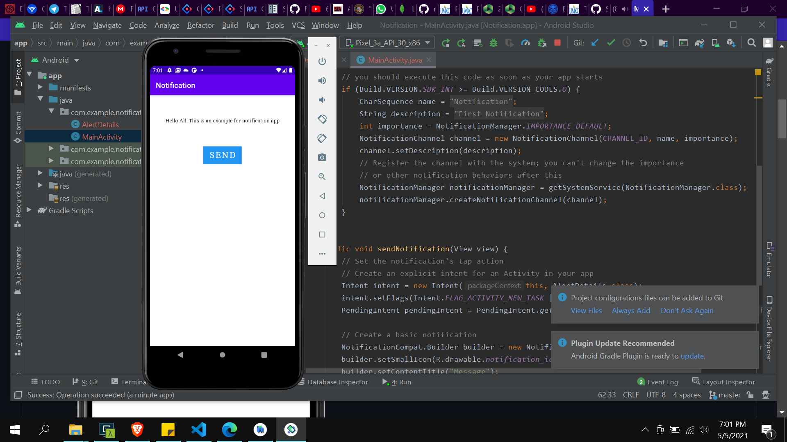
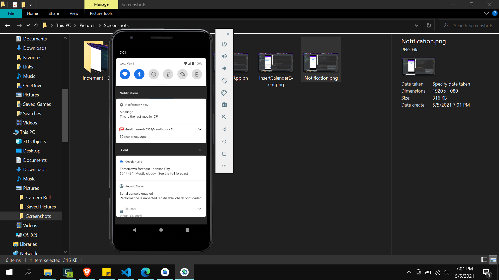
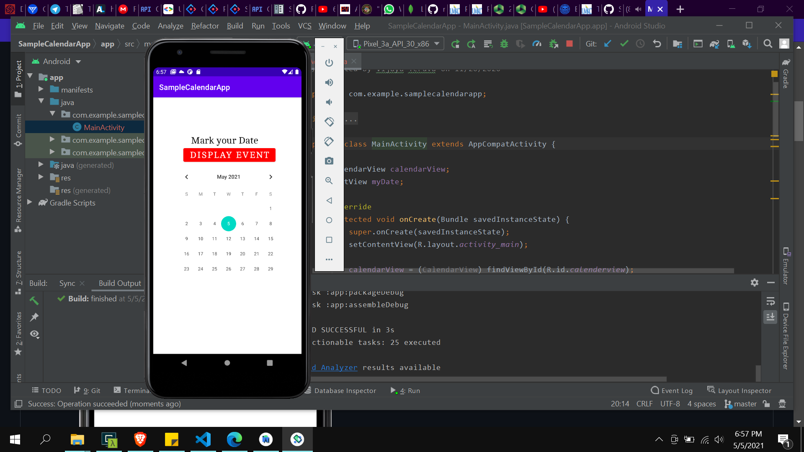
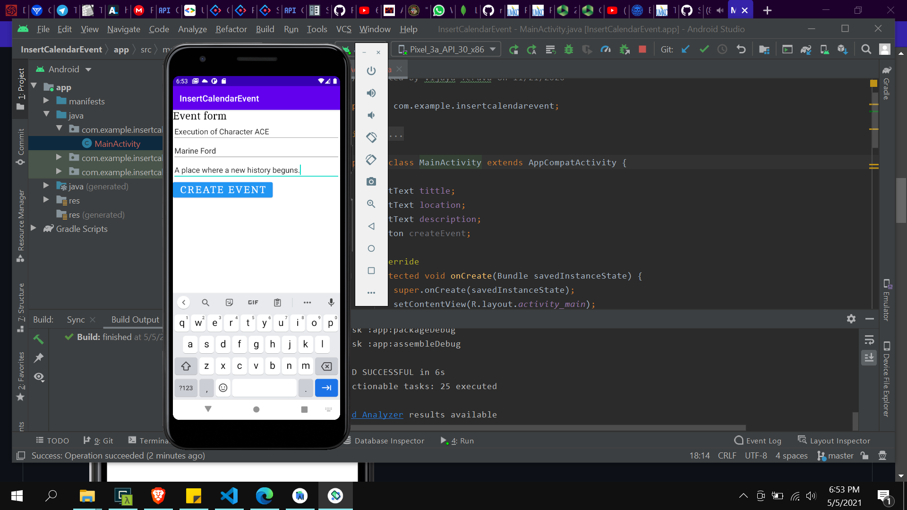
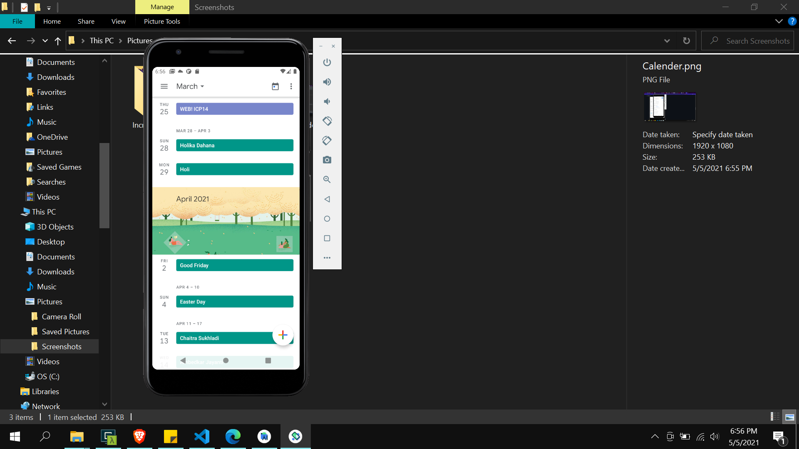
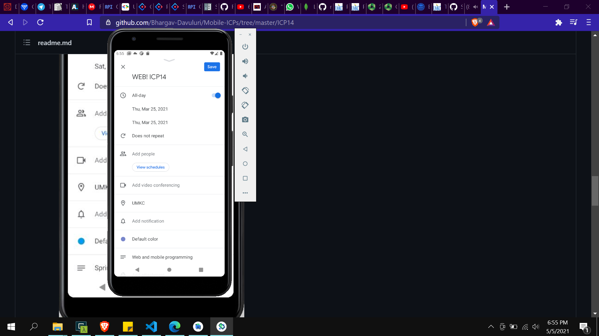

# This is the Readme file for the final Mobile ICP

This icp is all about learning calender events and notification messages.

# OUTPUTS

This application helps to generate a sample default notification which is staticly given by the user.

1. 

2. 

3. 

This application is used to set a event on the calender as a reminder

4. 

5. 

6. 
