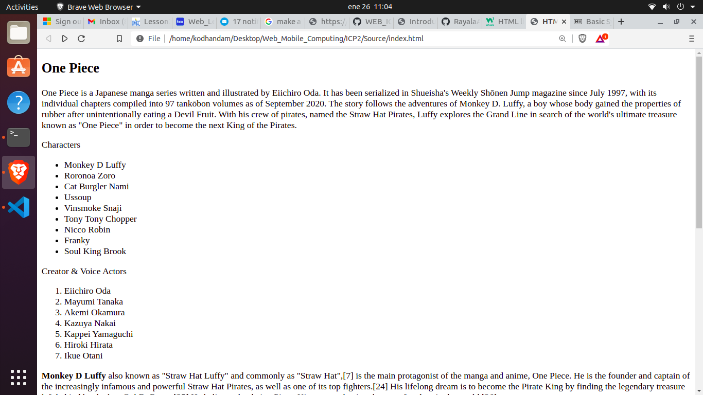
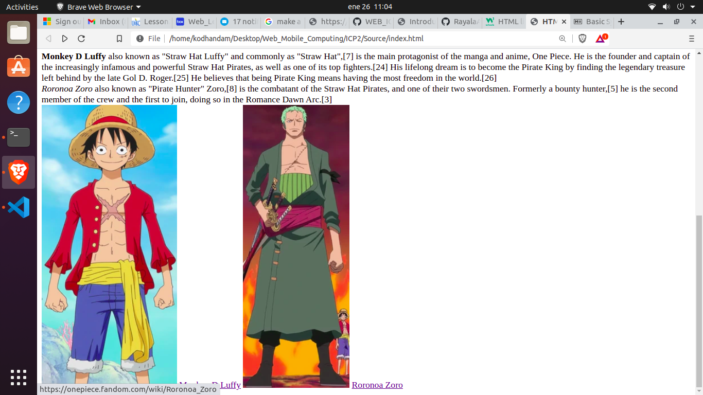

# Web Lesson 2

## This class is an introduction to html & css

In today's class we learned basics tags in html

1. Headings
2. Paragraph
3. Block Elements
4. In-line Elements
5. Ordered Lists
6. Unordered Lists
7. Image and video tags

# Outputs

