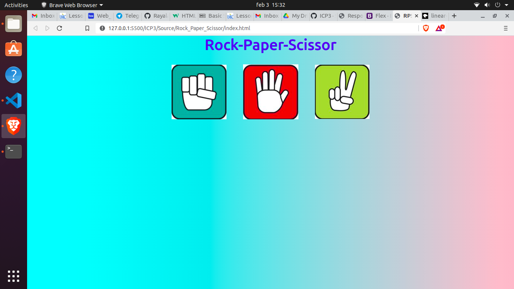
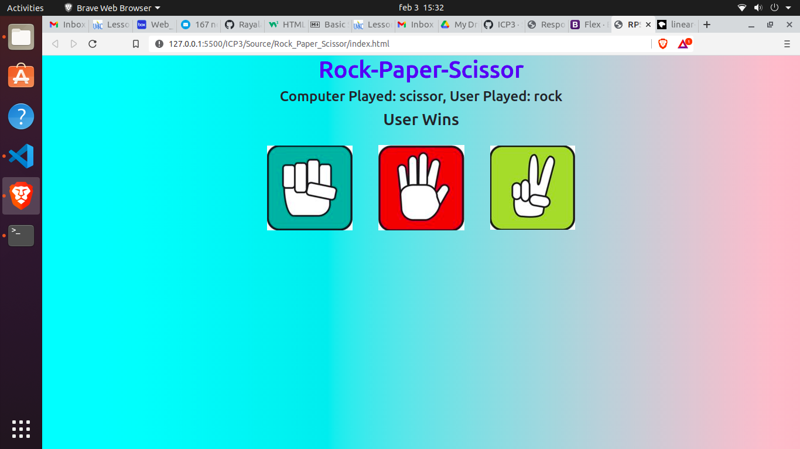
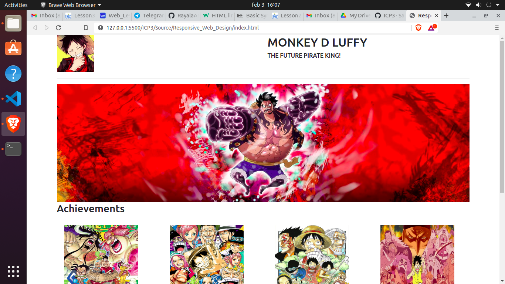
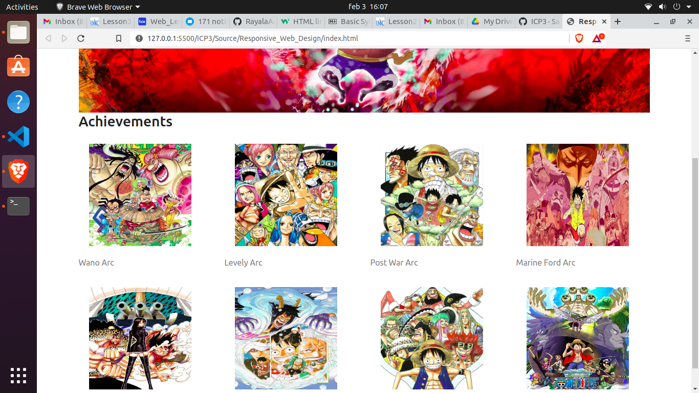
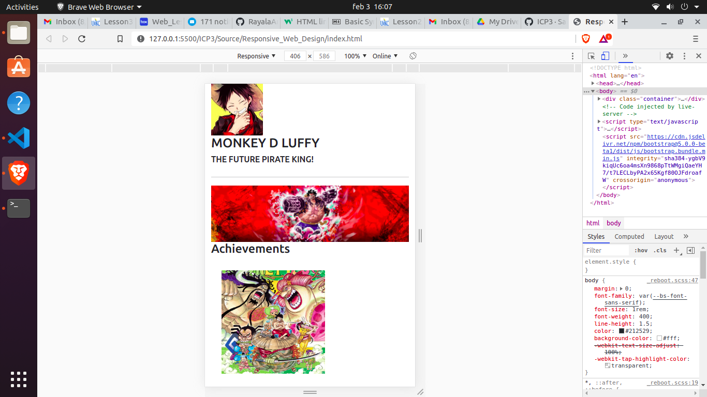
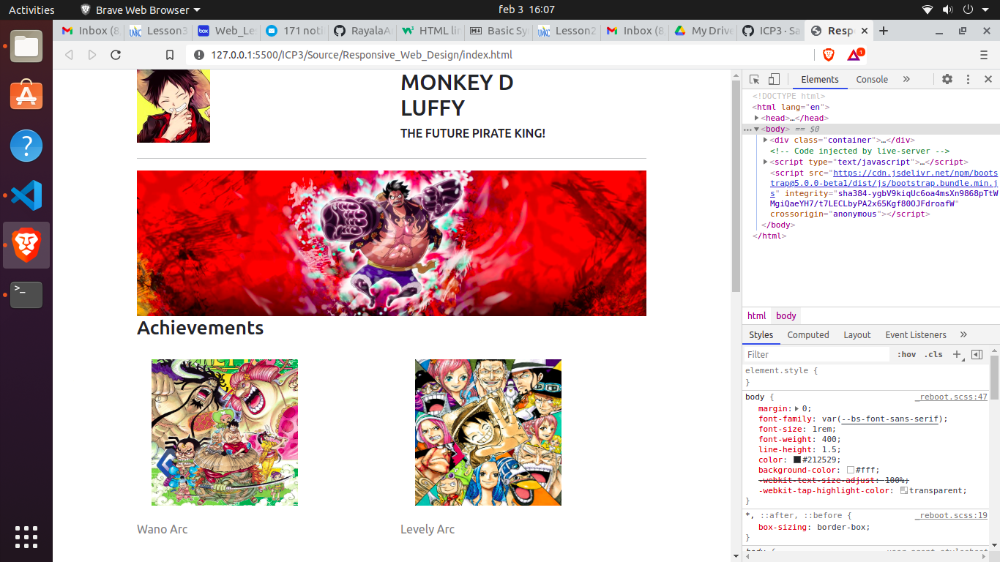

# This is for ICP3

This ICP3 is all learning bootstrap and basics of javascript and DOM(Document Object Model).

# Outputs

## Below are the outputs for ROCK-PAPER-SCISSOR

1. Output1 is the initial screen that pops when html file is first loaded.

   
   
2. Output2 is the result obtained when user clicks on something and a random value from 0-2 is fetched for the computer.

   

## These are the outputs for Responsive-Web-Design

1. Full screen

   
   
2. Full Screen Grid View

   
   
3. Mobile View

   
   
4. Tablet View

   
