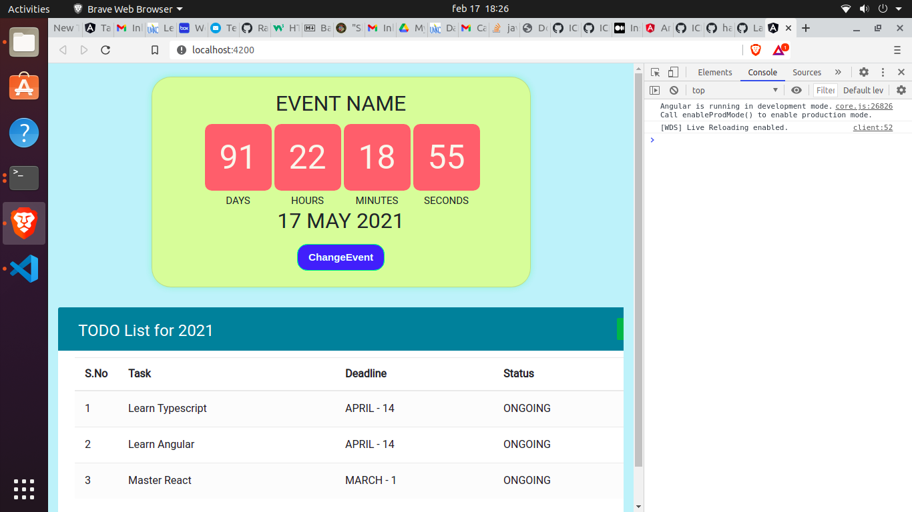

# ICP-5 work.

In this ICP I've learned all about typescript following the official typescript and angular documentation for initial installation of angular.

# Requirements for this ICP

1. Nodejs
2. Install angular cli by using this command. **npm install -g @angular/cli**
3. Follow angular documentaion where says get started to get with your initial angular project.

# OUTPUTS

## Both the tasks TIMER AND TODOLIST are displayed below.

1. Initial screen when command **ng server --open** is executed.
   

2. Tablet view
   

3. Mobile view for Countdown
   

4. Mobile view for TODO-LIST
   
