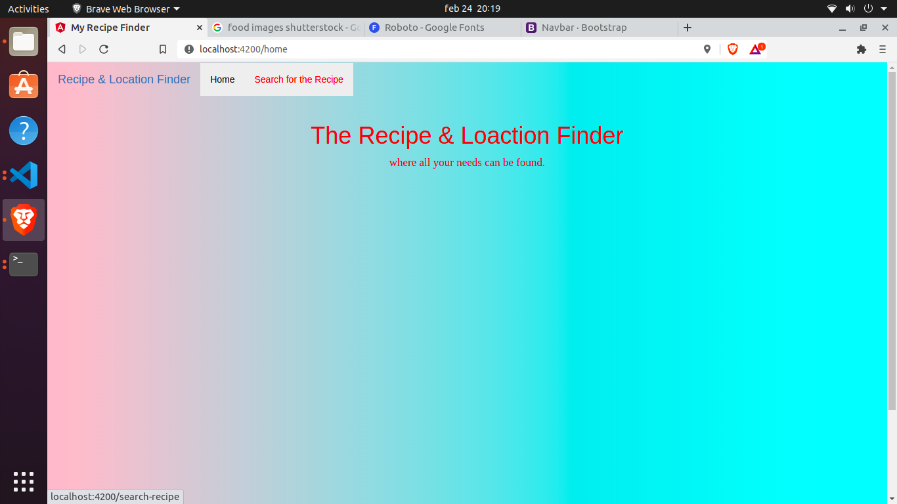
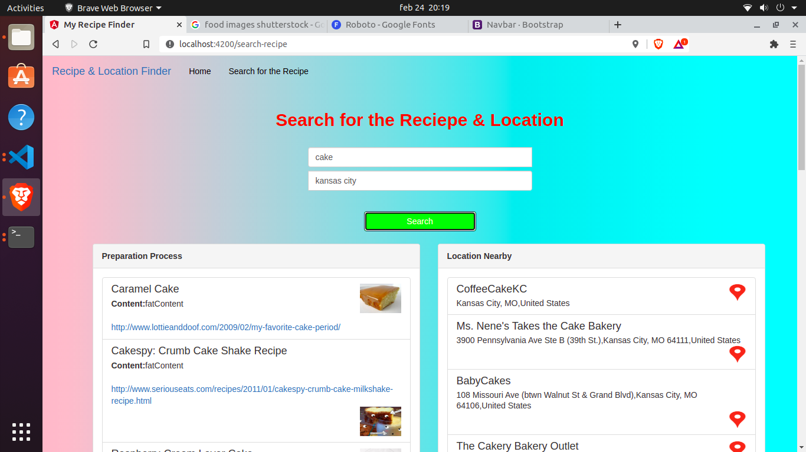
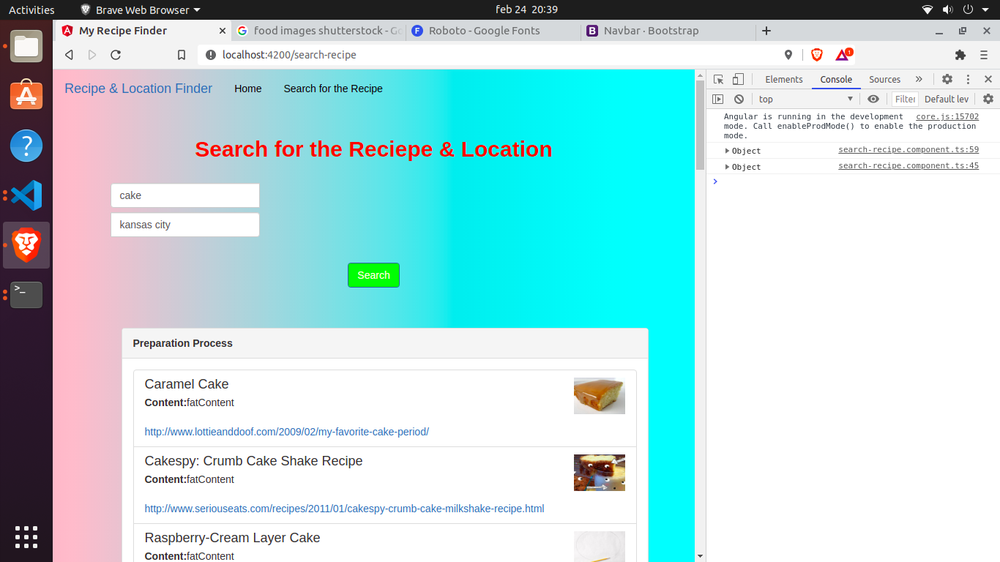
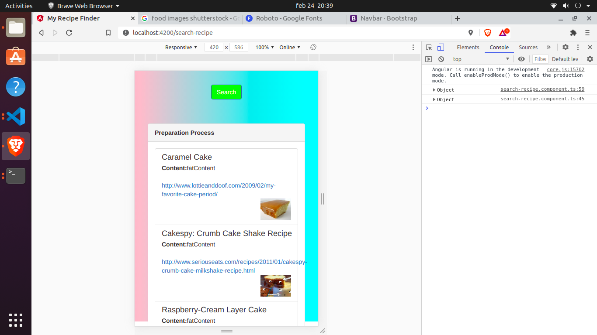

# This is the ICP6 Work.

In this ICP I've understood how components in Angular works like how to transfer data from child component to parent and also data from parent component to child component. And also I've learned more input and output decorators which are used from transfering data between the components.

Ofcourse typescript was also used but most of the type declarations were set to type any just to avoid errors.

# Outputs

1. Initial screen when **ng serve --open** was executed.
   

2. Searching for the recipes and locations nearby
   

3. Tablet view
   

4. Mobile View
   
