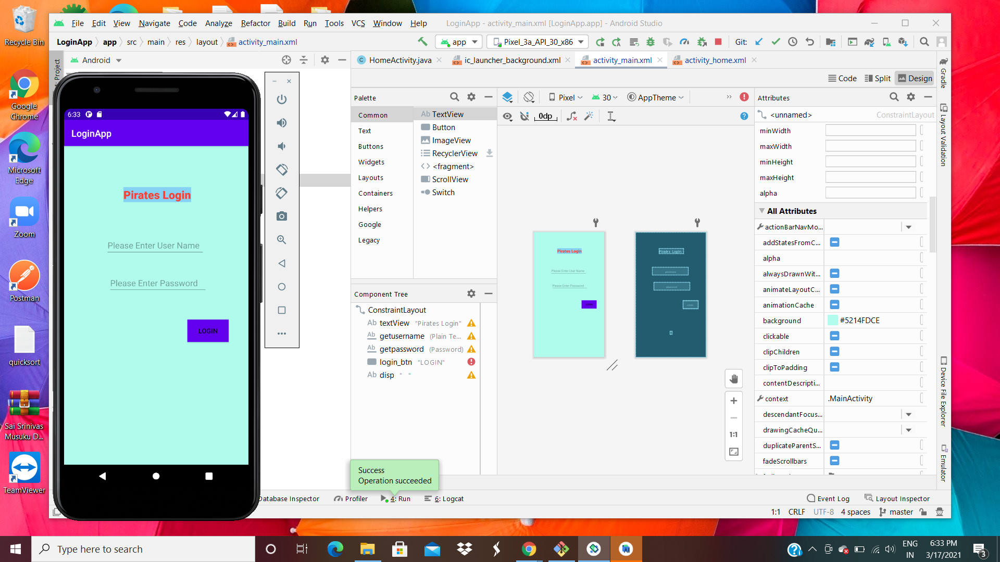
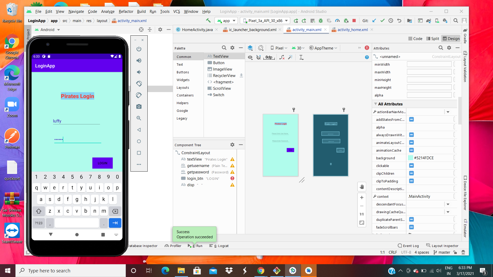
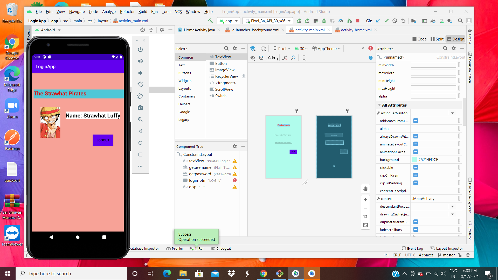

# This is my ICP8 work

In which in this ICP i mostly learned about how to use android studio i.e how to install and use it for either setting up a new project or to open and existing project.

# OUTPUTS

1. Initial screen when application is built.
   

2. After populating the login details
   

3. Home Screen with all predefined data
   

4. When the logout button is clicked it just brings you back to the inital login screen.
